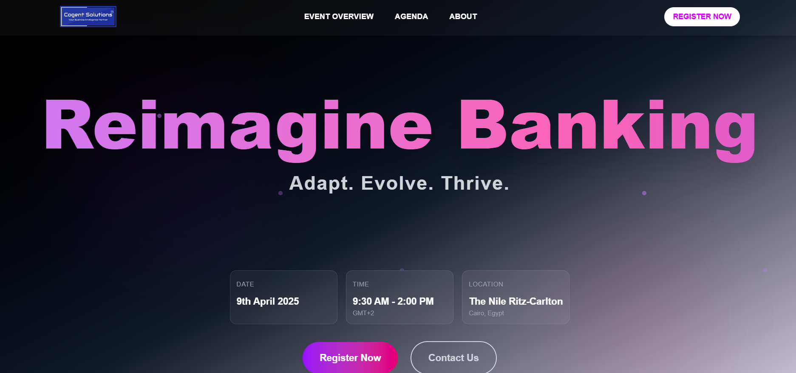
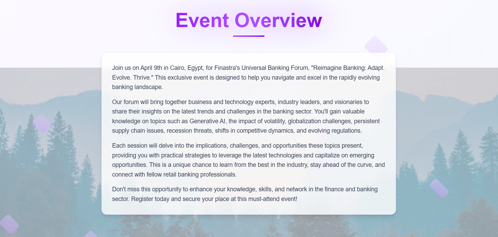
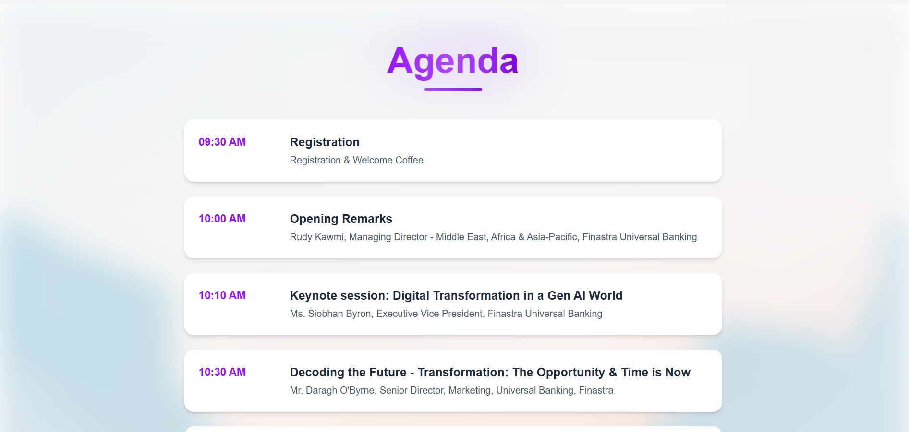

# 🌐 Reimagine Banking: Adapt. Evolve. Thrive.

A modern, responsive landing page built with **React**, **Vite**, **Tailwind CSS**, and **Framer Motion** for animations. This project includes a Node.js/Express backend for handling form submissions or data integrations.

---

## 📸 Screenshots

### Hero Section



### Event Overview Section



### Agenda Section



> 💡 To add your own screenshots, place images in the `screenshots/` folder and update the paths above.

---

## 🚀 Features

* ✨ Beautiful landing page layout
* 🎨 Tailwind CSS for styling
* 🎮 Framer Motion animations
* ⚙️ Node.js backend with Express
* 🔗 Contact/registration form integration
* 🌐 Responsive design (mobile-first)
* 📄 Agenda section with timeline layout and parallax background

---

## 📁 Folder Structure

```
landing_page/
│
├── public/
├── src/
│   ├── assets/         # Images, logos
│   ├── components/     # Reusable UI components
│   ├── pages/          # Page-level components
│   └── main.jsx        # Entry point
├── server/             # Node/Express backend
│   └── index.js
├── screenshots/        # Screenshots for README
├── package.json
├── README.md
└── vite.config.js
```

---

## 🛠️ Installation & Setup

### 1. Clone the repository

```bash
git clone https://github.com/your-username/reimagine-banking-landing-page.git
cd reimagine-banking-landing-page/landing_page
```

### 2. Install dependencies

```bash
npm install
```

> If you see an error like `'vite' is not recognized`, it means `node_modules` is missing. Run `npm install` to fix it.

### 3. Start the development server

```bash
npm run dev
```

Then open: [http://localhost:5173](http://localhost:5173)

### 4. Start the backend (optional)

```bash
cd server
npm install
node index.js
```

---

## ⚙️ Tech Stack

* Frontend:

  * [React](https://reactjs.org/)
  * [Vite](https://vitejs.dev/)
  * [Tailwind CSS](https://tailwindcss.com/)
  * [Framer Motion](https://www.framer.com/motion/)

* Backend:

  * [Node.js](https://nodejs.org/)
  * [Express](https://expressjs.com/)

---

## 👩‍💻 Developed By

**Ishani Arunika**
*Graduate Software Engineer*

---

## 📦 Deployment

To build for production:

```bash
npm run build
```

To preview the production build locally:

```bash
npm run preview
```

---

## 📬 Feedback / Contact

Feel free to reach out if you have suggestions or want to collaborate!

---
